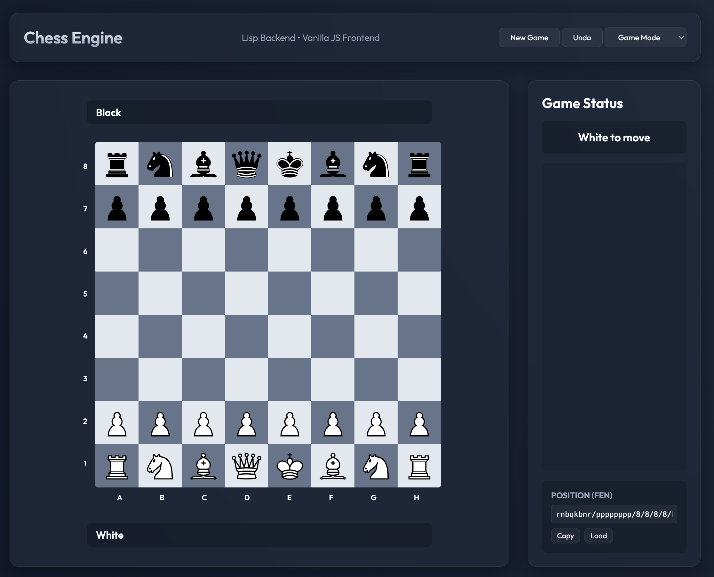

# Chess Machine ♟️🤖

A professional-grade chess engine and analysis tool built with a **Common Lisp** backend and a modern **Vanilla JS** frontend.



## Features

### 🎮 Game Mode
*   **Full Rule Enforcement**: Accurate move validation, including strict ray-casting for sliding pieces (Bishops, Rooks, Queens).
*   **Game Status Tracking**: Automatic detection of turns and game states.
*   **Material Analysis**: Real-time display of captured pieces and material advantage.

### 🔍 Explore Mode
*   **Custom Setups**: Add or remove pieces using a specialized piece palette.
*   **Free Manipulation**: Drag pieces anywhere on the board to analyze specific positions or puzzles.
*   **Atomic Interaction**: Drag pieces off-board to remove them instantly.
*   **Smooth Playback**: Switch from Explore to Game Mode at any time to play from your custom position.

### 🛠 Technical Highlights
*   **Backend**: SBCL-powered Lisp server using `Hunchentoot` for high-performance API handling.
*   **Frontend**: Ultra-clean Glassmorphism UI with responsive CSS Grid layouts.
*   **Position Management**: Full **FEN (Forsyth-Edwards Notation)** support for importing and exporting positions.
*   **Performance**: Optimistic UI updates ensure that dragging and dropping feels instantaneous.

## Getting Started

1.  Ensure you have **SBCL** and **Quicklisp** installed.
2.  Run the server:
    ```bash
    sbcl --script start.lisp
    ```
3.  Open `frontend/index.html` in your browser.

## License
MIT
